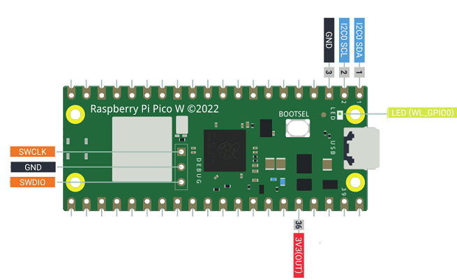
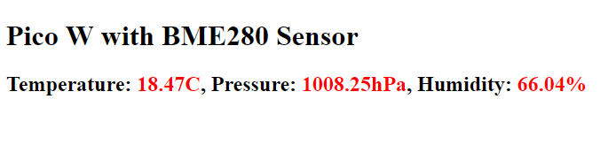

# Raspberry Pi Pico W (WiFi) with BME280 Sensor

A small project to demonstrate how to set up a simple web server using the Pi Pico W (WiFi) board

The BME280 is an environmental sensor capable of measuring temperature, pressure and humidity. The sensor interface code is 
based on a version originally developed by Adafruit Industries. See the copyright information in the `BME280.py` file header for full details.

## Setup

Attach the sensor to the Pi Pico as shown below

Pi Pico | Pin | BME280
------ | ------- | -------
GP0 | 1 | SDA
GP1 | 2 | SCL
GND | 3 | GND
3V3(OUT) | 4 | 2-6V

## Code

The example presented here was developed using [PyCharm](https://www.jetbrains.com/pycharm/) from [JetBrains](https://www.jetbrains.com/) using 
the [MicroPython](https://plugins.jetbrains.com/plugin/9777-micropython) plugin.

The [code](main.py) is in a style to aid understanding rather than being production ready. For example:

* Lots of output to show what is happening
* Various delays between steps with LED flashing to demonstrate progress if running disconnected
* Minimalist error handling - if broken, restart !

## Example Output

If you deploy and run the program, opening a browser connection to the address shown in the 

_**Web server is now listening on address: a.b.c.d**_ 

message, should give you a simple page with the sensor values

## Useful Links

The [BME280](https://shop.pimoroni.com/products/bme280-breakout) sensor used

Bosch [datasheet](https://www.bosch-sensortec.com/media/boschsensortec/downloads/datasheets/bst-bme280-ds002.pdf) for the sensor

## Coffee

If you find this project useful, you may want to [__Buy me a Coffee!__ :coffee:](https://www.buymeacoffee.com/codesqueak) Thanks :thumbsup:
